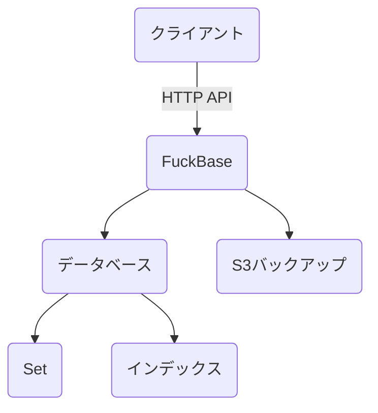
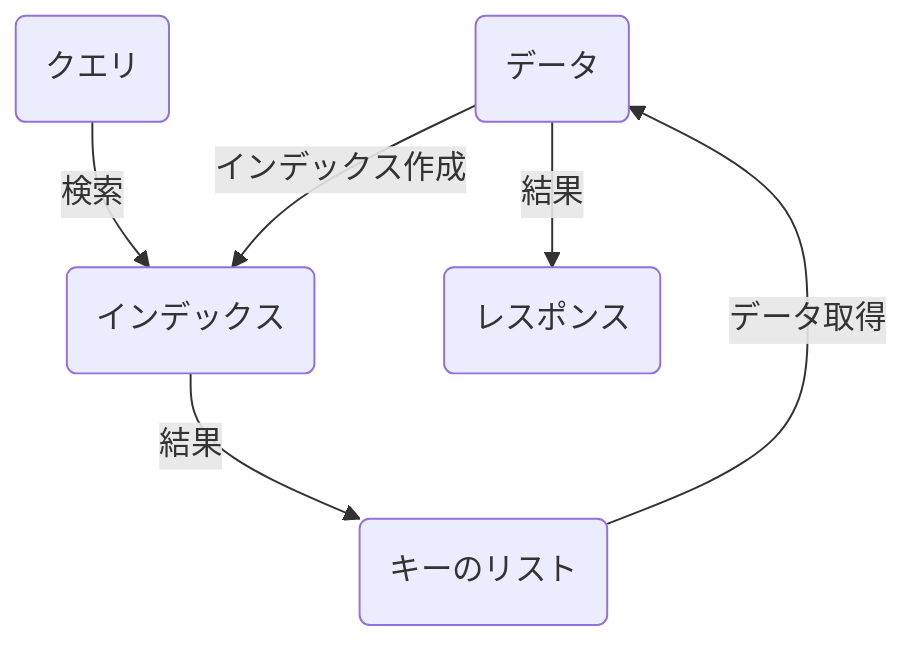
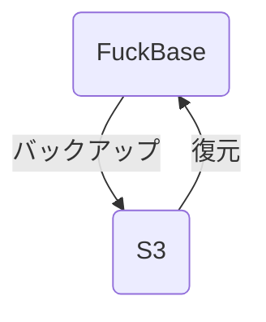
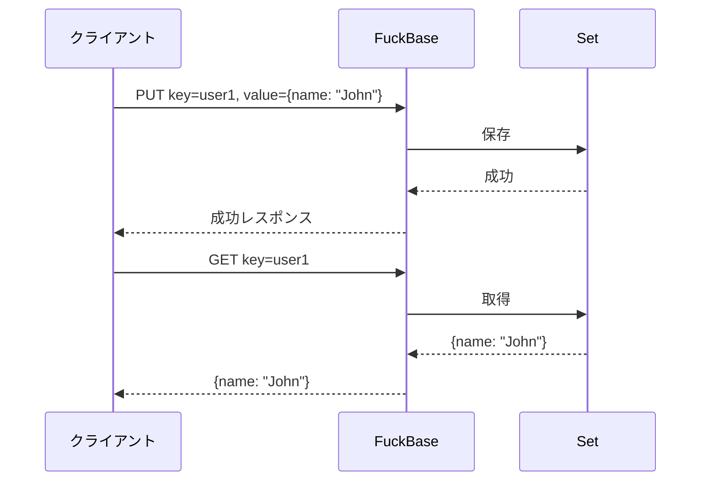
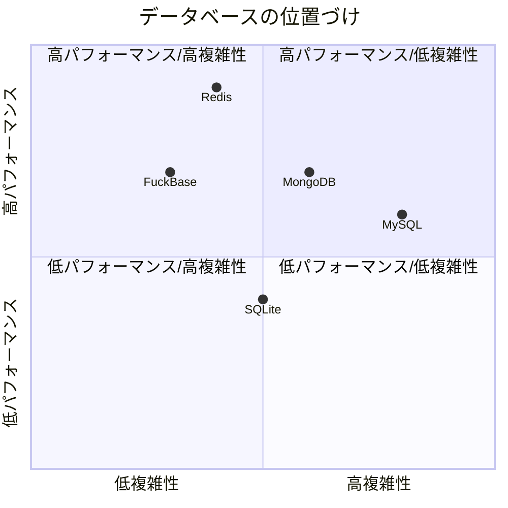

# 第1章: イントロダクション

## FuckBaseの概要

FuckBaseは、Goで実装されたシンプルで高速なHTTPベースのデータベースです。キーバリューストアの機能に加え、強力なインデックス機能とS3連携機能を備えています。



FuckBaseは、シンプルさと高速性を重視して設計されており、複雑なSQLデータベースほどの機能は持ちませんが、多くのユースケースで十分な機能を提供します。特に、小規模から中規模のアプリケーションのバックエンドストレージとして適しています。

## 主要な特徴

FuckBaseの主要な特徴は以下の通りです：

### 1. シンプルなHTTP API

FuckBaseのすべての操作は、HTTP POSTリクエストを通じて行われます。これにより、任意の言語やプラットフォームからFuckBaseを利用することができます。APIはシンプルで直感的に設計されており、学習コストが低いのが特徴です。

```bash
# データの保存例
curl -X POST http://localhost:8080/set/put -d '{
  "database": "mydb",
  "set": "users",
  "key": "user1",
  "value": {
    "name": "John Doe",
    "email": "john@example.com"
  }
}'
```

APIの詳細な実装は [../internal/server/handlers.go](../internal/server/handlers.go) で確認できます。

### 2. MessagePackエンコーディング

内部的には、データはMessagePackを使用してエンコードされます。MessagePackは、JSONのようなデータ構造をバイナリ形式でシリアライズするためのフォーマットで、JSONよりもコンパクトで処理が高速です。


MessagePackの実装は [../internal/database/set.go](../internal/database/set.go) で確認できます。

### 3. 強力なインデックス機能

FuckBaseは、保存されたデータに対する二次インデックスをサポートしています。これにより、特定のフィールドの値に基づいてデータを効率的に検索することができます。また、ソートとページネーションもサポートしています。



インデックスの実装は [../internal/database/index.go](../internal/database/index.go) で確認できます。

### 4. S3連携機能

FuckBaseは、Amazon S3やMinIOなどのS3互換ストレージとの連携機能を提供しています。これにより、データベースのバックアップと復元が可能になります。



S3連携機能の実装は [../internal/s3/backup.go](../internal/s3/backup.go) と [../internal/s3/client.go](../internal/s3/client.go) で確認できます。

### 5. 軽量設計

FuckBaseは最小限のリソース消費で高速に動作するように設計されています。メモリ内データストアとして機能し、ディスクI/Oを最小限に抑えることで高いパフォーマンスを実現しています。

## 使用例

FuckBaseは以下のようなユースケースに適しています：

### 1. 高速なキーバリューストア

シンプルなキーバリューストアとして使用できます。キーに対して任意の値（文字列、数値、オブジェクトなど）を保存し、後で取得することができます。



### 2. 単純なドキュメントデータベース

JSONライクなドキュメントを保存し、インデックスを使用して特定のフィールドに基づいて検索することができます。これにより、MongoDBのような単純なドキュメントデータベースとして機能します。

### 3. キャッシュシステム

高速なレスポンスが必要なデータのキャッシュとして使用できます。メモリ内で動作するため、アクセス速度が非常に高速です。

### 4. 一時的なデータストレージ

セッション情報や一時的なデータの保存に適しています。S3バックアップ機能を使用すれば、永続化も可能です。

### 5. マイクロサービスのバックエンドストレージ

マイクロサービスアーキテクチャにおいて、各サービスのデータストアとして使用できます。HTTPベースのシンプルなAPIを提供するため、異なる言語で実装されたサービス間でも簡単に連携できます。

## FuckBaseの位置づけ

FuckBaseは、以下のような既存のデータベースと比較して、どのような位置づけにあるのでしょうか：



- **Redis**: インメモリキーバリューストアとしては似ていますが、FuckBaseはHTTPベースのAPIを提供し、より簡単に使用できます。また、インデックス機能がより強力です。

- **MongoDB**: ドキュメント指向データベースとしては、MongoDBの方が高度なクエリ機能を持っていますが、FuckBaseはより軽量でシンプルです。

- **SQLデータベース（MySQL、PostgreSQLなど）**: リレーショナルデータベースと比較すると、FuckBaseはスキーマレスでより柔軟ですが、結合操作やトランザクションなどの高度な機能はありません。

FuckBaseは、これらの既存のデータベースの代替というよりも、特定のユースケースに特化した補完的なツールとして位置づけられます。シンプルさ、高速性、使いやすさを重視する場合に適しています。

次の章では、FuckBaseのアーキテクチャについて詳しく見ていきます。