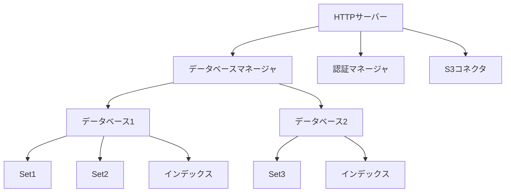
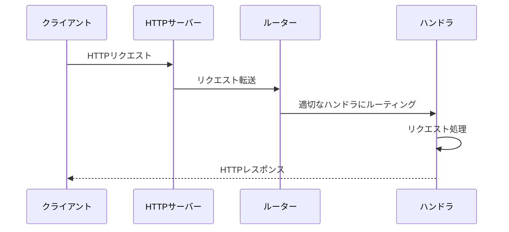
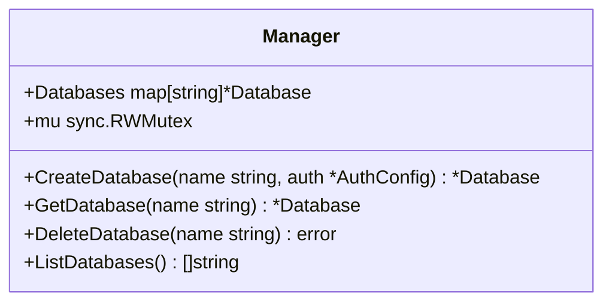
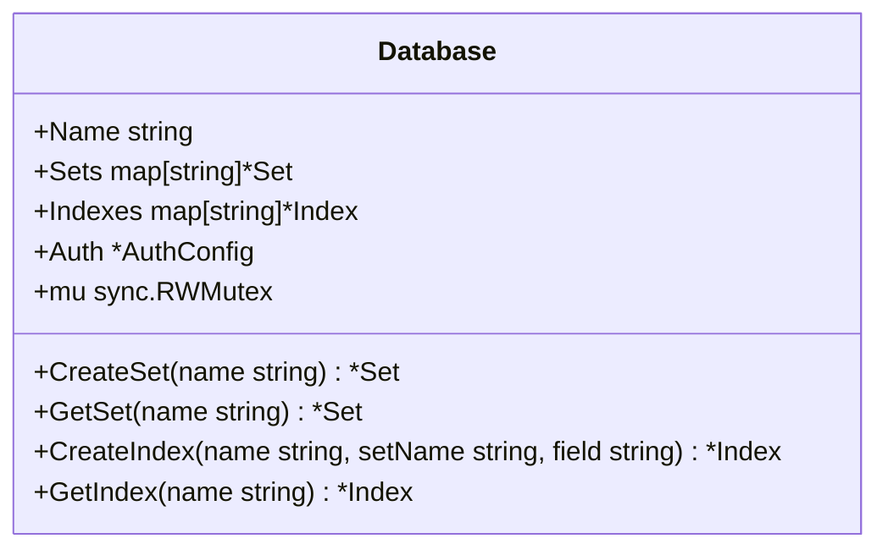
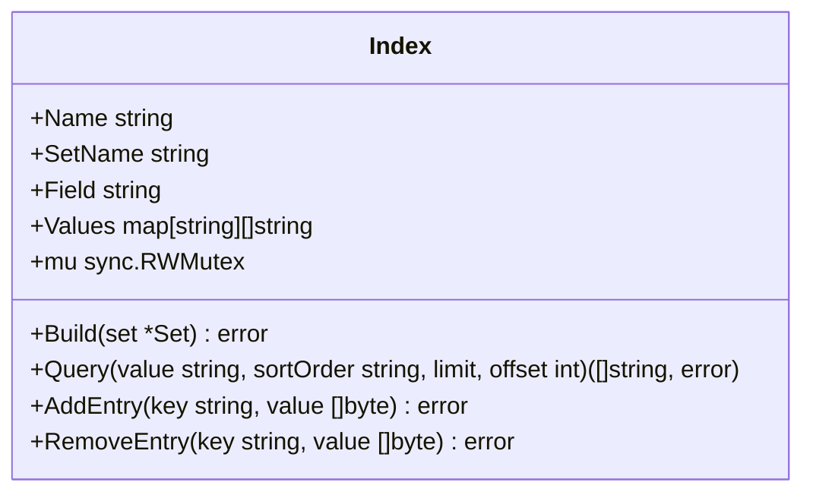
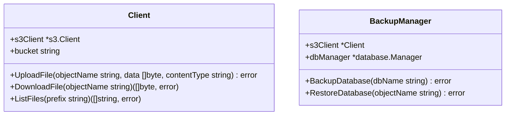
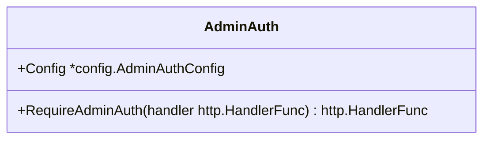
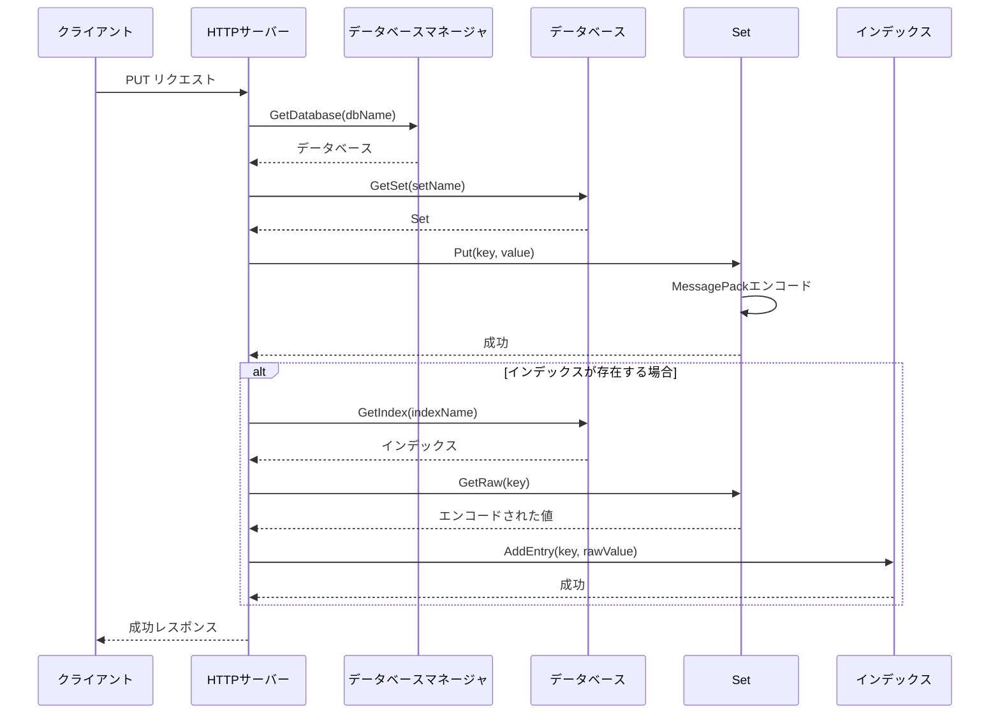
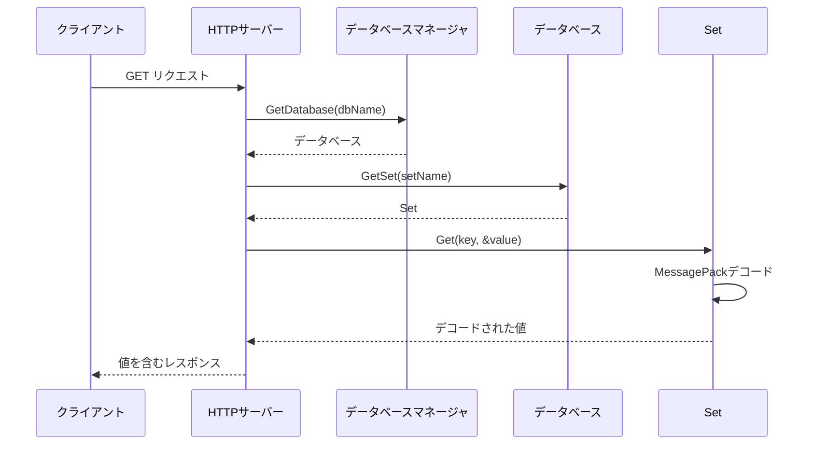
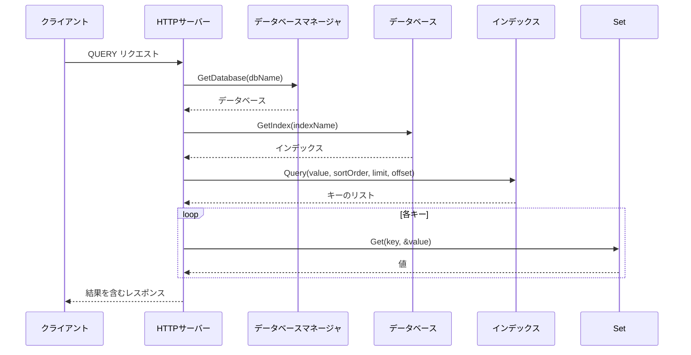

# 第2章: アーキテクチャ概要

この章では、FuckBaseの全体的なアーキテクチャと主要なコンポーネントについて説明します。

## 全体構造

FuckBaseは、以下の主要コンポーネントで構成されています：



この構造は階層的になっており、上位のコンポーネントが下位のコンポーネントを管理する形になっています。例えば、データベースマネージャは複数のデータベースを管理し、各データベースは複数のSetとインデックスを管理します。

## コアコンポーネント

### 1. HTTPサーバー

HTTPサーバーは、FuckBaseの外部インターフェースとなるコンポーネントです。クライアントからのHTTPリクエストを受け付け、適切なコンポーネントに転送します。



HTTPサーバーの実装は [../internal/server/server.go](../internal/server/server.go) で確認できます。

### 2. データベースマネージャ

データベースマネージャは、複数のデータベースインスタンスを管理するコンポーネントです。データベースの作成、削除、アクセス制御などを担当します。



データベースマネージャの実装は [../internal/database/manager.go](../internal/database/manager.go) で確認できます。

### 3. データベース

データベースは、複数のSetとインデックスを管理するコンポーネントです。各データベースは独立しており、他のデータベースとデータを共有することはありません。



データベースの実装は [../internal/database/database.go](../internal/database/database.go) で確認できます。

### 4. Set

Setは、キーバリューペアを保存するコンポーネントです。内部的には、Goのマップ（`map[string][]byte`）を使用しています。値はMessagePackでエンコードされたバイト配列として保存されます。

```mermaid
classDiagram
    class Set {
        +Name string
        +Data map[string][]byte
        +mu sync.RWMutex
        +Put(key string, value interface{}) error
        +Get(key string, dest interface{}) error
        +Delete(key string) error
        +Keys() []string
    }
```

Setの実装は [../internal/database/set.go](../internal/database/set.go) で確認できます。

### 5. インデックス

インデックスは、Setのデータに対する二次インデックスを提供するコンポーネントです。特定のフィールドの値からキーのリストへのマッピングを管理します。



インデックスの実装は [../internal/database/index.go](../internal/database/index.go) で確認できます。

### 6. S3コネクタ

S3コネクタは、S3互換ストレージとの連携を担当するコンポーネントです。バックアップと復元の処理を行います。



S3コネクタの実装は [../internal/s3/client.go](../internal/s3/client.go) と [../internal/s3/backup.go](../internal/s3/backup.go) で確認できます。

### 7. 認証マネージャ

認証マネージャは、ユーザー認証とアクセス制御を担当するコンポーネントです。管理者認証と一般ユーザー認証を区別します。



認証マネージャの実装は [../internal/server/auth.go](../internal/server/auth.go) で確認できます。

## データフロー

FuckBaseにおけるデータフローを理解することは、システム全体の動作を理解する上で重要です。以下に、主要な操作におけるデータフローを示します。

### データ保存フロー



### データ取得フロー



### インデックスクエリフロー



## コンポーネント間の相互作用

FuckBaseのコンポーネントは、以下のように相互作用します：

1. **HTTPサーバー → データベースマネージャ**: HTTPサーバーは、クライアントからのリクエストを受け取り、データベースマネージャに対して操作を要求します。

2. **データベースマネージャ → データベース**: データベースマネージャは、リクエストに応じて適切なデータベースを選択し、操作を転送します。

3. **データベース → Set/インデックス**: データベースは、リクエストに応じて適切なSetやインデックスを選択し、操作を転送します。

4. **HTTPサーバー → 認証マネージャ**: HTTPサーバーは、認証が必要なリクエストを認証マネージャに転送し、認証の結果に応じて処理を続行するかどうかを決定します。

5. **HTTPサーバー → S3コネクタ**: バックアップや復元のリクエストがあった場合、HTTPサーバーはS3コネクタに操作を要求します。

## まとめ

FuckBaseは、シンプルながらも効率的なアーキテクチャを持っています。各コンポーネントは明確な責任を持ち、相互に連携して動作します。この設計により、シンプルさを保ちながらも、必要な機能を提供することができています。

次の章では、FuckBaseの主要なデータ構造について詳しく見ていきます。