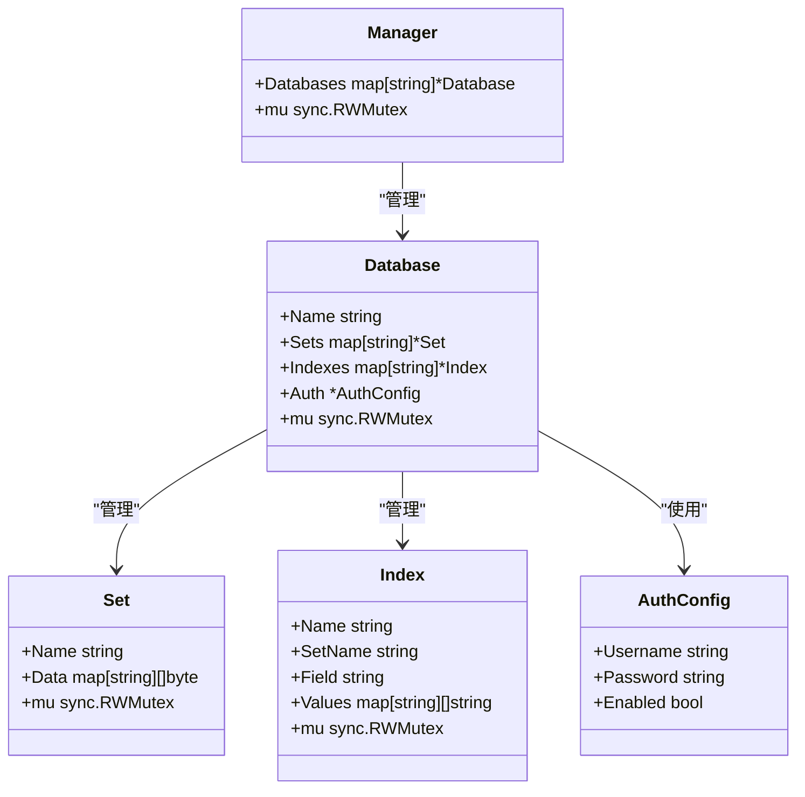
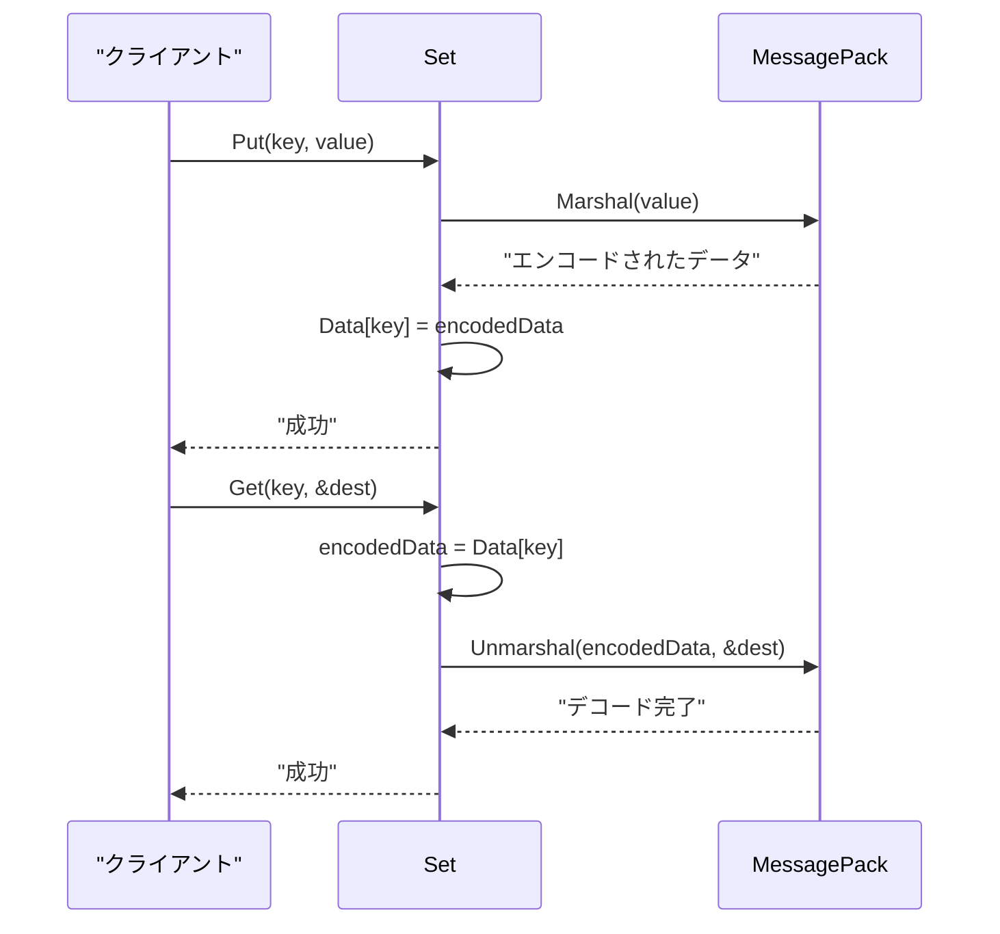
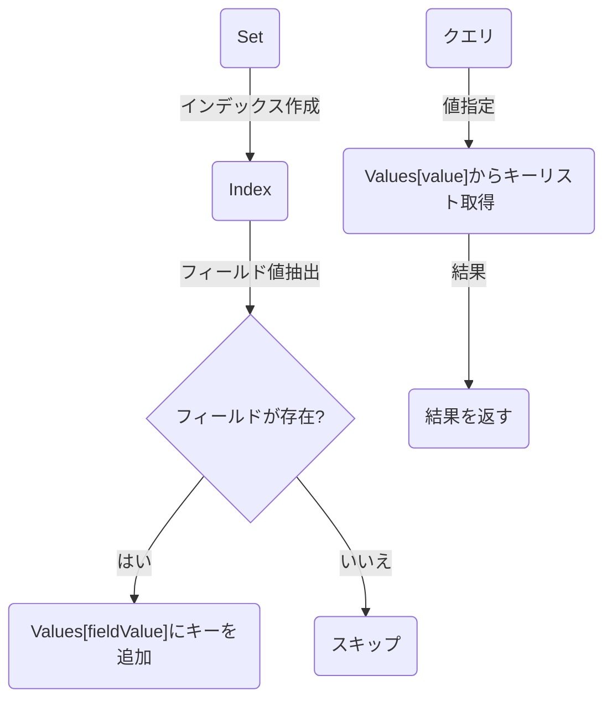
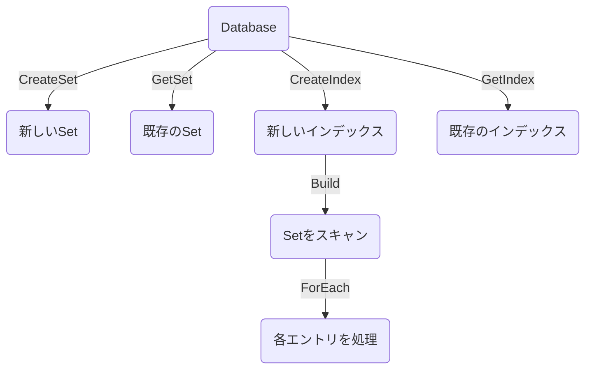
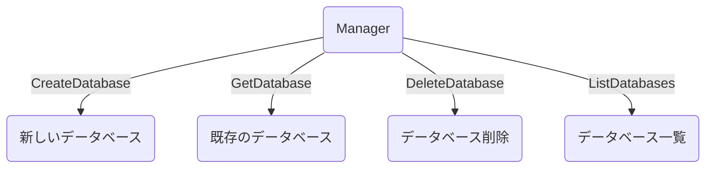

# 第3章: データ構造

この章では、FuckBaseの主要なデータ構造について説明します。FuckBaseは、いくつかの基本的なデータ構造を組み合わせて構築されています。これらのデータ構造を理解することで、FuckBaseの内部動作をより深く理解することができます。

## 主要なデータ構造の概要

FuckBaseの主要なデータ構造は以下の通りです：

各データ構造の詳細な実装は以下のファイルで確認できます：
- Manager: [../internal/database/manager.go](../internal/database/manager.go)
- Database: [../internal/database/database.go](../internal/database/database.go)
- Set: [../internal/database/set.go](../internal/database/set.go)
- Index: [../internal/database/index.go](../internal/database/index.go)

## Set

Setは、FuckBaseの最も基本的なデータ構造で、キーバリューペアを保存するために使用されます。

### 構造と機能

- **名前**: 各Setは一意の名前を持ちます
- **データストア**: 内部的には`map[string][]byte`を使用してデータを保存
- **値のエンコード**: すべての値はMessagePackを使用してバイト配列にエンコード
- **並行アクセス制御**: 読み書きミューテックス（`sync.RWMutex`）を使用

### 主要な操作

- **Put**: キーに対して値を保存（MessagePackエンコード）
- **Get**: キーに対応する値を取得（MessagePackデコード）
- **GetRaw**: キーに対応するエンコードされた生データを取得
- **Delete**: キーと値のペアを削除
- **Has**: キーが存在するかどうかを確認
- **Keys**: すべてのキーのリストを取得
- **Size**: キーバリューペアの数を取得
- **ForEach**: すべてのキーと値に対して関数を実行
- **Clear**: すべてのキーと値のペアを削除

## Index

Indexは、Setのデータに対する二次インデックスを提供するデータ構造です。特定のフィールドの値に基づいてデータを効率的に検索するために使用されます。

### 構造と機能

- **名前**: 各インデックスは一意の名前を持ちます
- **Set名**: インデックスが関連付けられているSetの名前
- **フィールド**: インデックスが作成されるフィールドの名前
- **値マップ**: `map[string][]string`を使用してフィールド値からキーのリストへのマッピングを保存
- **並行アクセス制御**: 読み書きミューテックスを使用

### 主要な操作

- **Build**: Setのすべてのエントリをスキャンしてインデックスを構築
- **Query**: 指定された値に一致するキーのリストを返す
- **AddEntry**: 新しいエントリをインデックスに追加
- **RemoveEntry**: エントリをインデックスから削除

## Database

Databaseは、複数のSetとインデックスを管理するデータ構造です。

### 構造と機能

- **名前**: 各データベースは一意の名前を持ちます
- **Sets**: Set名からSetへのマップ
- **Indexes**: インデックス名からインデックスへのマップ
- **認証**: オプションの認証設定
- **並行アクセス制御**: 読み書きミューテックスを使用

### 主要な操作

- **CreateSet**: 新しいSetを作成
- **GetSet**: 名前でSetを取得
- **CreateIndex**: 指定されたSet上に新しいインデックスを作成
- **GetIndex**: 名前でインデックスを取得
- **Authenticate**: ユーザー認証を行う

## Manager

Managerは、複数のデータベースを管理するデータ構造です。

### 構造と機能

- **Databases**: データベース名からデータベースへのマップ
- **並行アクセス制御**: 読み書きミューテックスを使用

### 主要な操作

- **CreateDatabase**: 新しいデータベースを作成
- **GetDatabase**: 名前でデータベースを取得
- **DeleteDatabase**: データベースを削除
- **ListDatabases**: すべてのデータベース名のリストを返す

## データ構造間の関係

FuckBaseのデータ構造は階層的な関係を持っています：

1. **Manager**: 最上位の構造で、複数のデータベースを管理
2. **Database**: 複数のSetとインデックスを管理
3. **Set**: キーバリューペアを保存
4. **Index**: Setのデータに対する二次インデックスを提供

この階層構造により、データの論理的な分離と効率的なアクセスが可能になっています。

## まとめ

FuckBaseのデータ構造は、シンプルながらも効率的に設計されています。キーバリューストアの基本機能に加え、インデックスによる高速な検索機能を提供しています。各コンポーネントは明確な責任を持ち、相互に連携して動作します。

次の章では、FuckBaseの並行処理と同期の仕組みについて詳しく見ていきます。