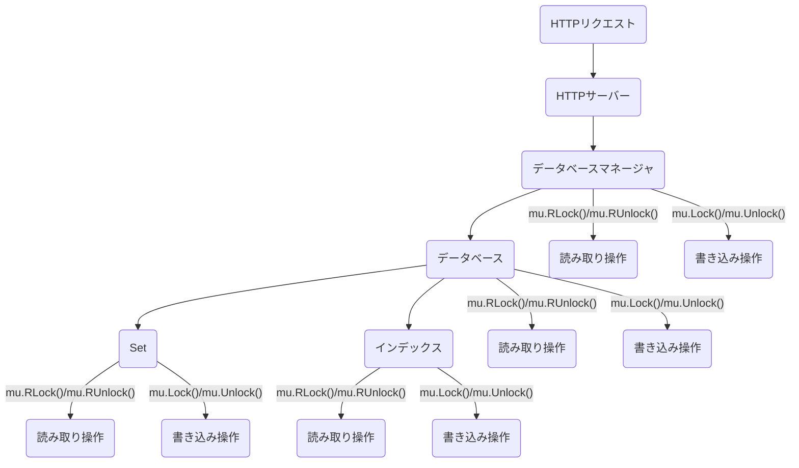
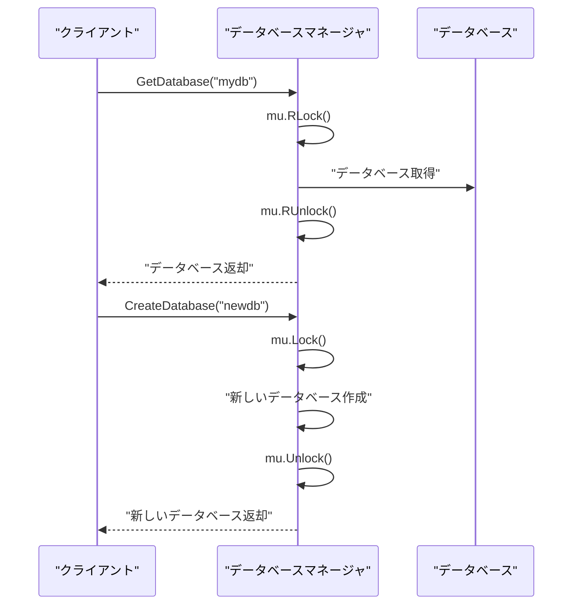
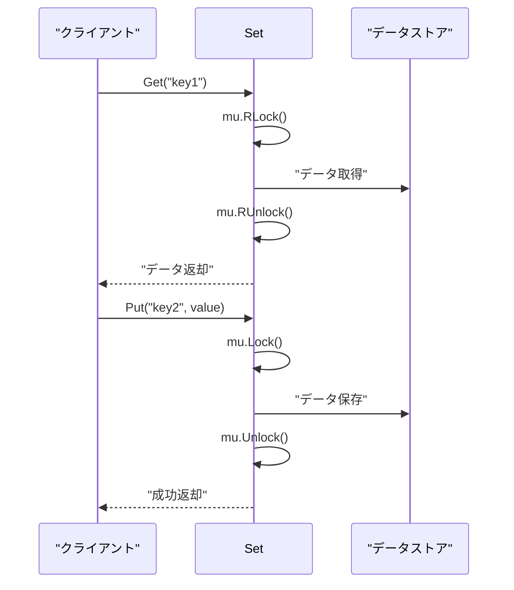

# 第4章: 並行処理と同期

この章では、FuckBaseにおける並行処理と同期の仕組みについて説明します。Goは並行処理を簡単に実装できる言語として知られていますが、複数のゴルーチンが同じデータにアクセスする場合、適切な同期が必要です。

## 並行処理の必要性

FuckBaseはHTTPサーバーとして動作し、複数のクライアントからの同時リクエストを処理する必要があります。例えば、以下のような状況が考えられます：

- 複数のクライアントが同じデータベースに対して読み取り操作を行う
- あるクライアントがデータを書き込んでいる間に、別のクライアントが同じデータを読み取ろうとする
- 複数のクライアントが同じキーに対して書き込み操作を行う

これらの状況で、適切な同期機構がなければ、データの不整合（レースコンディション）が発生する可能性があります。

## FuckBaseの同期アーキテクチャ

FuckBaseでは、各コンポーネント（Manager、Database、Set、Index）が独自のミューテックスを持ち、データアクセスを同期しています。



## Goの同期プリミティブ

FuckBaseでは、主に以下の同期プリミティブを使用しています：

### sync.RWMutex

`sync.RWMutex`は、読み書きミューテックスを提供します。これは、読み取り操作と書き込み操作を区別し、複数の読み取り操作を同時に許可しながら、書き込み操作は排他的に行うための仕組みです。

- 読み取り操作には `RLock()`/`RUnlock()` を使用
- 書き込み操作には `Lock()`/`Unlock()` を使用

詳細なコード実装は以下のファイルで確認できます：
- [../internal/database/manager.go](../internal/database/manager.go)
- [../internal/database/database.go](../internal/database/database.go)
- [../internal/database/set.go](../internal/database/set.go)
- [../internal/database/index.go](../internal/database/index.go)

## 各コンポーネントでの同期パターン

### 1. データベースマネージャでの同期

データベースマネージャは、複数のデータベースを管理するコンポーネントです。データベースの作成、削除、アクセスなどの操作を同期するために、読み書きミューテックスを使用しています。



### 2. データベースでの同期

データベースは、複数のSetとインデックスを管理するコンポーネントです。Setやインデックスの作成、削除、アクセスなどの操作を同期するために、読み書きミューテックスを使用しています。

### 3. Setでの同期

Setは、キーバリューペアを保存するコンポーネントです。データの読み取りと書き込みを同期するために、読み書きミューテックスを使用しています。



### 4. インデックスでの同期

インデックスは、Setのデータに対する二次インデックスを提供するコンポーネントです。インデックスの読み取りと更新を同期するために、読み書きミューテックスを使用しています。

## 同期の重要なポイント

### 1. デッドロックの防止

FuckBaseでは、デッドロックを防ぐために、常に同じ順序でロックを取得するようにしています。例えば、データベースのロックを取得してからSetのロックを取得するという順序を守ります。

### 2. defer を使用したロック解放

Goの `defer` ステートメントを使用して、関数の終了時に確実にロックを解放するようにしています。これにより、エラーが発生した場合でもロックが解放されることが保証されます。

```go
func (s *Set) Get(key string, dest interface{}) error {
    s.mu.RLock()
    defer s.mu.RUnlock()
    
    // 処理...
}
```

### 3. 最小限のクリティカルセクション

パフォーマンスを最大化するために、ロックで保護されるクリティカルセクションを最小限に保つようにしています。必要な操作だけをロックの中で行い、時間のかかる処理（例：外部APIの呼び出し）はロックの外で行います。

## まとめ

FuckBaseでは、Goの読み書きミューテックスを使用して、複数のクライアントからの同時アクセスを安全に処理しています。各コンポーネントが独自のミューテックスを持ち、読み取り操作と書き込み操作を適切に同期することで、データの整合性を保ちながら高い並行性を実現しています。

次の章では、FuckBaseのHTTPサーバーとAPIについて詳しく見ていきます。