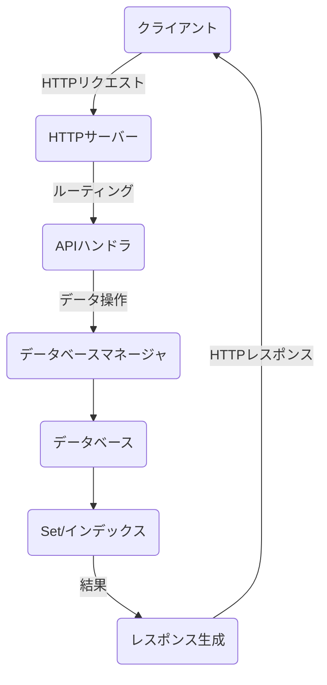
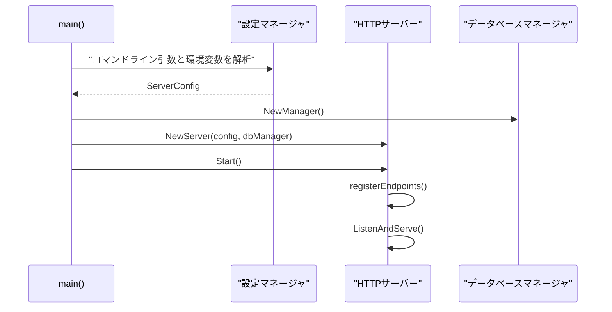
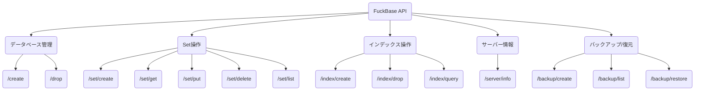
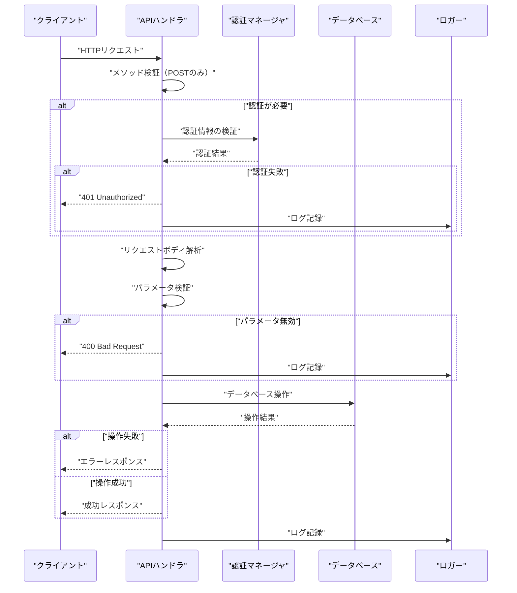
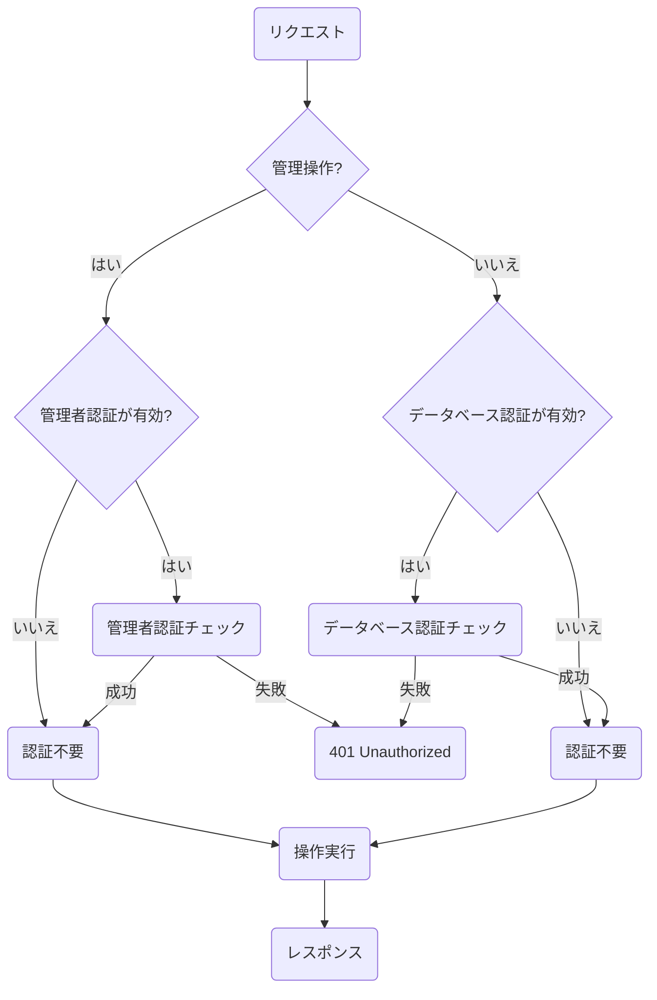

# 第5章: HTTPサーバーとAPI

この章では、FuckBaseのHTTPサーバーとAPIの実装について説明します。FuckBaseはHTTPベースのデータベースであり、すべての操作はHTTP APIを通じて行われます。

## HTTPサーバーの概要

FuckBaseのHTTPサーバーは、Goの標準ライブラリ（`net/http`）を使用して実装されています。サーバーは指定されたポートでリクエストを待ち受け、各APIエンドポイントに対応するハンドラ関数を呼び出します。



サーバーの実装は [../internal/server/server.go](../internal/server/server.go) で確認できます。

## サーバーの起動と設定

FuckBaseサーバーは、コマンドラインオプションや環境変数から設定を読み込み、HTTPサーバーを起動します。主な設定項目には、ポート番号、ホスト名、管理者認証情報、S3バックアップ設定などがあります。



## APIエンドポイント

FuckBaseは、以下のカテゴリのAPIエンドポイントを提供しています：

1. データベース管理
2. Set操作
3. インデックス操作
4. サーバー情報
5. バックアップと復元（S3が有効な場合）

各エンドポイントの実装は [../internal/server/handlers.go](../internal/server/handlers.go) で確認できます。

### エンドポイント一覧



## リクエスト処理フロー

FuckBaseのリクエスト処理フローは、以下の一般的なパターンに従います：

1. HTTPリクエストを受信
2. リクエストメソッドの検証（POSTのみ許可）
3. 認証チェック（必要な場合）
4. リクエストボディの解析
5. リクエストパラメータの検証
6. データベース操作の実行
7. レスポンスの生成と送信
8. ログの記録



## 主要なAPIエンドポイントの詳細

### 1. データベース作成 (/create)

データベースを作成するエンドポイントです。オプションで認証情報を設定できます。

**リクエスト例**:
```json
{
  "name": "mydb",
  "auth": {
    "username": "user",
    "password": "pass"
  }
}
```

**レスポンス例**:
```json
{
  "status": "success",
  "message": "Database created successfully",
  "data": {
    "database": "mydb"
  }
}
```

### 2. データ保存 (/set/put)

Setにデータを保存するエンドポイントです。

**リクエスト例**:
```json
{
  "database": "mydb",
  "set": "users",
  "key": "user1",
  "value": {
    "name": "John Doe",
    "email": "john@example.com"
  }
}
```

**レスポンス例**:
```json
{
  "status": "success",
  "message": "Data stored successfully"
}
```

### 3. データ取得 (/set/get)

Setからデータを取得するエンドポイントです。

**リクエスト例**:
```json
{
  "database": "mydb",
  "set": "users",
  "key": "user1"
}
```

**レスポンス例**:
```json
{
  "status": "success",
  "data": {
    "name": "John Doe",
    "email": "john@example.com"
  }
}
```

### 4. インデックス作成 (/index/create)

Setのフィールドにインデックスを作成するエンドポイントです。

**リクエスト例**:
```json
{
  "database": "mydb",
  "set": "users",
  "name": "email_index",
  "field": "email"
}
```

**レスポンス例**:
```json
{
  "status": "success",
  "message": "Index created successfully",
  "data": {
    "index": "email_index"
  }
}
```

### 5. インデックスクエリ (/index/query)

インデックスを使用してデータをクエリするエンドポイントです。

**リクエスト例**:
```json
{
  "database": "mydb",
  "set": "users",
  "index": "email_index",
  "value": "john@example.com"
}
```

**レスポンス例**:
```json
{
  "status": "success",
  "data": {
    "count": 1,
    "data": [
      {
        "key": "user1",
        "value": {
          "name": "John Doe",
          "email": "john@example.com"
        }
      }
    ]
  }
}
```

## エラーハンドリング

FuckBaseは、エラーが発生した場合、適切なHTTPステータスコードとエラーメッセージを含むJSONレスポンスを返します。

```json
{
  "status": "error",
  "code": "DB_NOT_FOUND",
  "message": "Database not found"
}
```

主なエラーコードには以下のようなものがあります：

- `INVALID_REQUEST`: リクエストの形式が無効
- `METHOD_NOT_ALLOWED`: POSTメソッド以外のリクエスト
- `AUTH_FAILED`: 認証失敗
- `DB_NOT_FOUND`: データベースが見つからない
- `SET_NOT_FOUND`: Setが見つからない
- `KEY_NOT_FOUND`: キーが見つからない
- `INDEX_NOT_FOUND`: インデックスが見つからない
- `INTERNAL_ERROR`: 内部エラー

## 認証

FuckBaseは、2種類の認証をサポートしています：

1. **管理者認証**: データベースの作成や削除などの管理操作に必要
2. **データベース認証**: 特定のデータベースへのアクセスに必要

認証情報は、HTTPヘッダーまたはリクエストボディで提供できます。



## ロギング

FuckBaseは、すべてのリクエストとレスポンスをログに記録します。ログには、リクエストのメソッド、パス、ステータスコード、処理時間などの情報が含まれます。

```
INFO: POST /set/put 200 1.2ms
```

ログの実装は [../internal/logger/logger.go](../internal/logger/logger.go) で確認できます。

## まとめ

FuckBaseのHTTPサーバーとAPIは、シンプルながらも効率的に設計されています。すべての操作はHTTP POSTリクエストを通じて行われ、JSONレスポンスが返されます。認証、エラーハンドリング、ロギングなどの機能も備えており、実用的なデータベースサーバーとして機能します。

次の章では、FuckBaseのS3バックアップ機能について詳しく見ていきます。