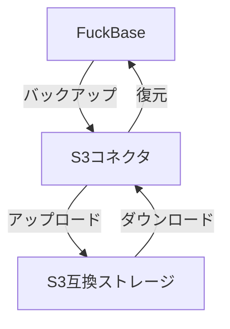
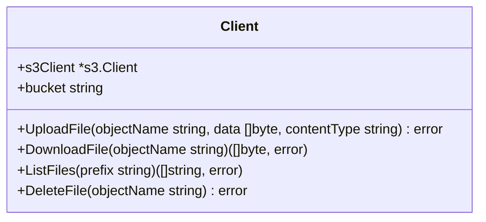
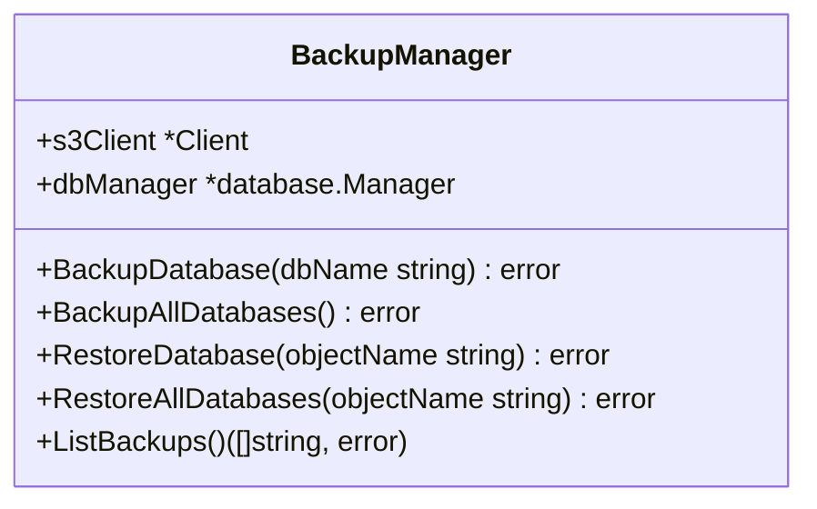
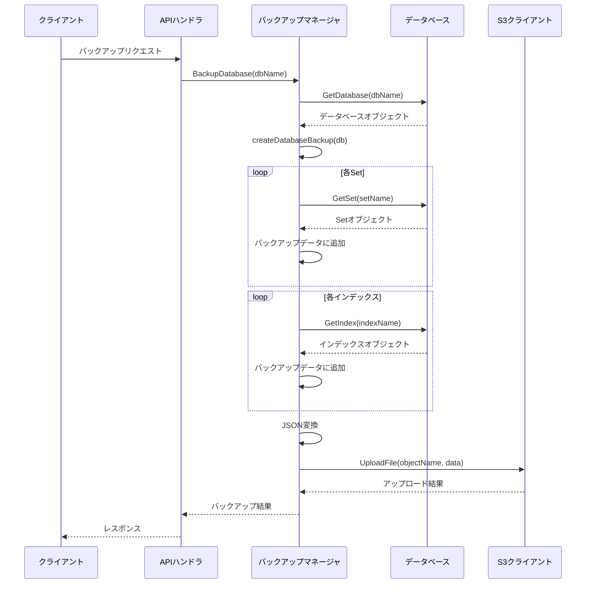
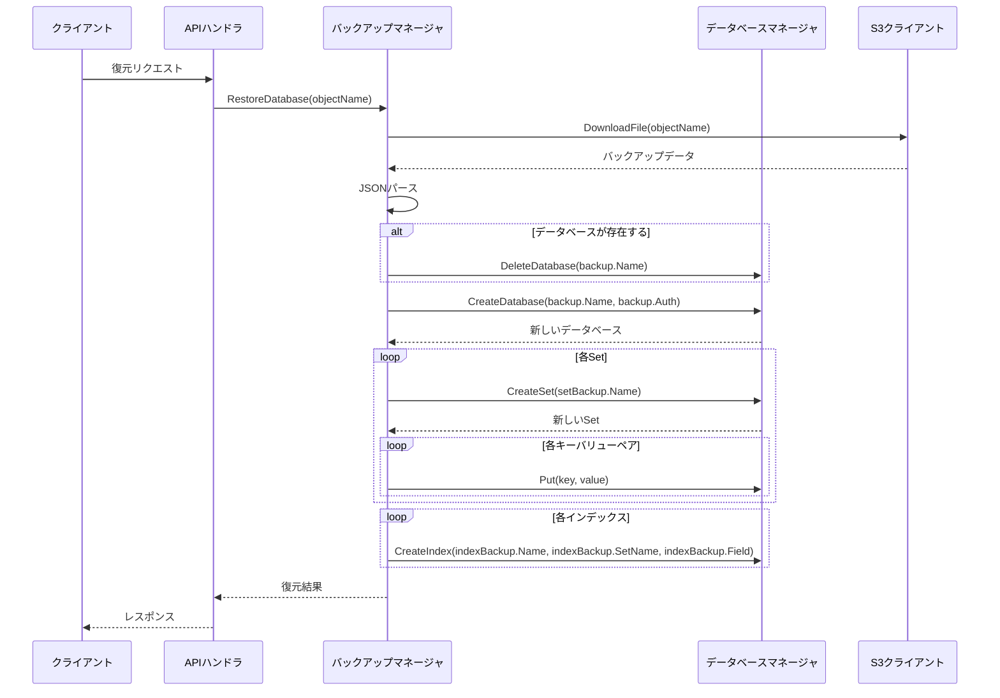
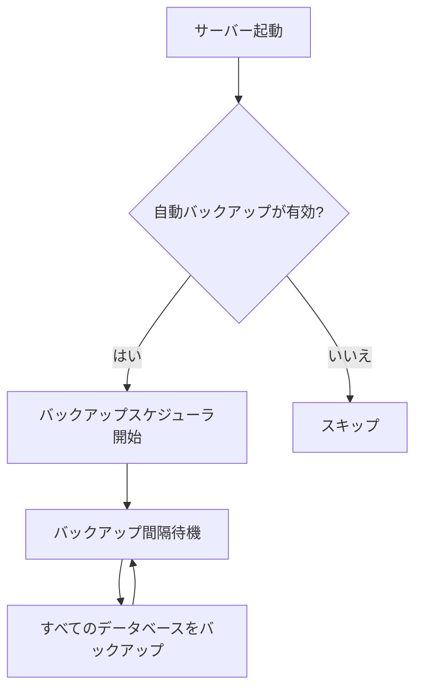
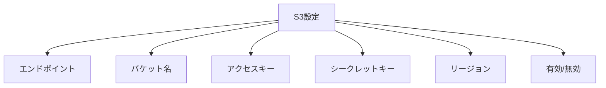

# 第6章: S3バックアップ機能

この章では、FuckBaseのS3バックアップ機能について説明します。FuckBaseは、Amazon S3やMinIOなどのS3互換ストレージとの連携機能を提供しており、データベースのバックアップと復元が可能です。

## S3バックアップの概要

S3バックアップ機能は、FuckBaseのデータを外部のS3互換ストレージに保存し、必要に応じて復元するための機能です。この機能により、以下のようなメリットがあります：

1. データの永続化
2. サーバー障害からの復旧
3. データの移行
4. バージョン管理



S3バックアップ機能の実装は [../internal/s3/backup.go](../internal/s3/backup.go) と [../internal/s3/client.go](../internal/s3/client.go) で確認できます。

## S3クライアント

FuckBaseは、AWS SDK for Goを使用してS3 APIと通信します。S3クライアントは、以下の主要な操作をサポートしています：

1. ファイルのアップロード
2. ファイルのダウンロード
3. ファイルの一覧取得
4. ファイルの削除



## バックアップマネージャ

バックアップマネージャは、S3クライアントとデータベースマネージャを連携させ、バックアップと復元の処理を行うコンポーネントです。



## バックアップデータ構造

バックアップデータは、JSONフォーマットで構造化されています。主なデータ構造は以下の通りです：

```mermaid
classDiagram
    class FullBackup {
        +Metadata BackupMetadata
        +Databases map[string]DatabaseBackup
    }
    
    class BackupMetadata {
        +Timestamp time.Time
        +Version string
        +DatabaseCount int
        +SetCount int
        +EntryCount int
    }
    
    class DatabaseBackup {
        +Name string
        +Sets map[string]SetBackup
        +Indexes map[string]IndexBackup
        +Auth *database.AuthConfig
    }
    
    class SetBackup {
        +Name string
        +Data map[string]interface{}
    }
    
    class IndexBackup {
        +Name string
        +SetName string
        +Field string
    }
    
    FullBackup --> BackupMetadata
    FullBackup --> DatabaseBackup
    DatabaseBackup --> SetBackup
    DatabaseBackup --> IndexBackup
```

## バックアップ処理フロー

バックアップ処理は、以下の手順で行われます：

1. データベースの読み取りロックを取得
2. データベースの状態をシリアライズ
3. S3にアップロード
4. 読み取りロックを解放



## 復元処理フロー

復元処理は、以下の手順で行われます：

1. S3からバックアップデータをダウンロード
2. JSONデータをパース
3. 既存のデータベースを削除（存在する場合）
4. 新しいデータベースを作成
5. Setとインデックスを復元



## 自動バックアップ

FuckBaseは、定期的な自動バックアップをサポートしています。バックアップ間隔は、サーバー設定で指定できます。



自動バックアップの実装は [../internal/server/server.go](../internal/server/server.go) の `startAutomaticBackups` メソッドで確認できます。

## バックアップAPIエンドポイント

FuckBaseは、バックアップと復元のための以下のAPIエンドポイントを提供しています：

1. `/backup/create`: バックアップを作成
2. `/backup/list`: バックアップの一覧を取得
3. `/backup/restore`: バックアップから復元

これらのエンドポイントは、S3が有効な場合にのみ利用可能です。

### バックアップ作成 (/backup/create)

指定されたデータベースのバックアップを作成します。

**リクエスト例**:
```json
{
  "database": "mydb"
}
```

**レスポンス例**:
```json
{
  "status": "success",
  "message": "Backup created successfully",
  "data": {
    "object_name": "backups/mydb/2023-01-01T12:00:00Z.json"
  }
}
```

### バックアップ一覧取得 (/backup/list)

利用可能なバックアップの一覧を取得します。

**リクエスト例**:
```json
{
  "database": "mydb"
}
```

**レスポンス例**:
```json
{
  "status": "success",
  "data": {
    "backups": [
      "backups/mydb/2023-01-01T12:00:00Z.json",
      "backups/mydb/2023-01-02T12:00:00Z.json"
    ]
  }
}
```

### バックアップ復元 (/backup/restore)

指定されたバックアップからデータベースを復元します。

**リクエスト例**:
```json
{
  "object_name": "backups/mydb/2023-01-01T12:00:00Z.json"
}
```

**レスポンス例**:
```json
{
  "status": "success",
  "message": "Database restored successfully"
}
```

## S3設定

FuckBaseのS3連携機能を使用するには、以下の設定が必要です：



これらの設定は、コマンドラインオプションまたは環境変数で指定できます。

```bash
fuckbase --s3-endpoint https://s3.amazonaws.com --s3-bucket my-backup-bucket --s3-access-key ACCESS_KEY --s3-secret-key SECRET_KEY --s3-region us-east-1
```

## S3互換ストレージ

FuckBaseは、以下のようなS3互換ストレージと連携できます：

1. Amazon S3
2. MinIO
3. Wasabi
4. Backblaze B2
5. その他のS3互換ストレージ

## まとめ

FuckBaseのS3バックアップ機能は、データの永続化と障害復旧のための重要な機能です。S3互換ストレージとの連携により、データを安全に保存し、必要に応じて復元することができます。自動バックアップ機能を使用すれば、定期的なバックアップを自動化することも可能です。

次の章では、FuckBaseの実践的な使用例について見ていきます。