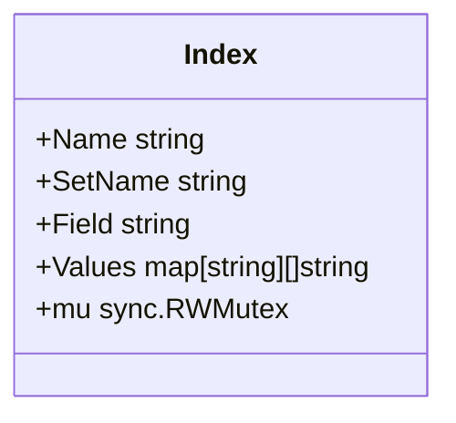
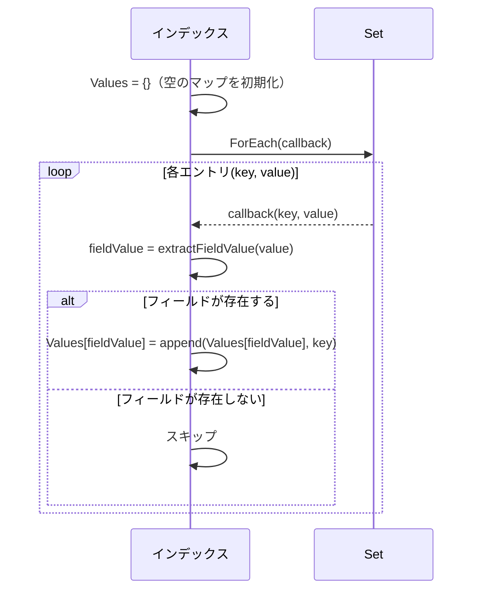
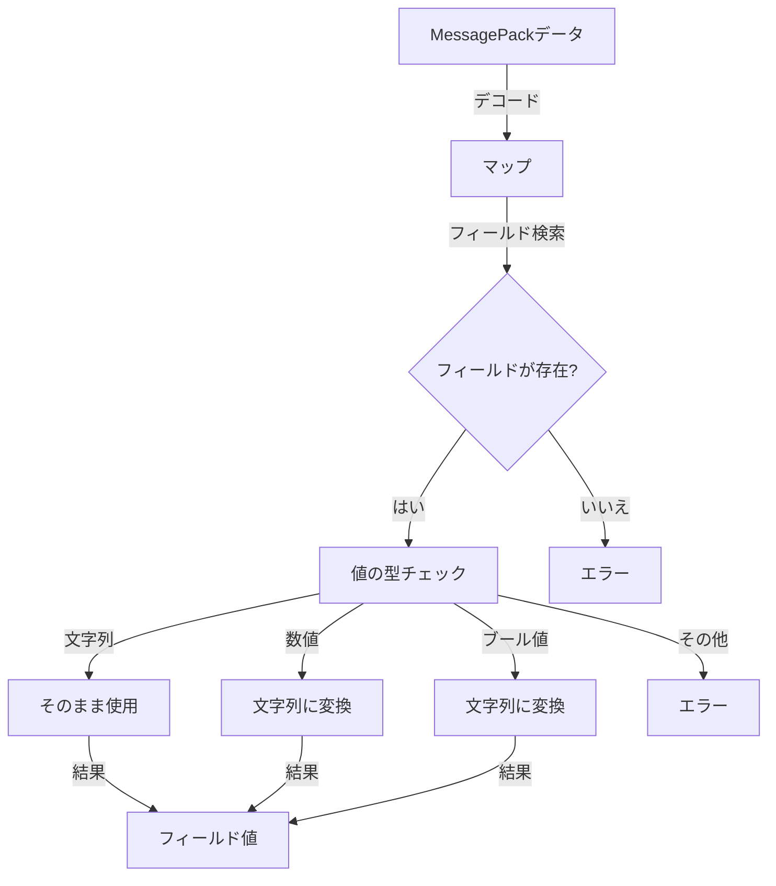
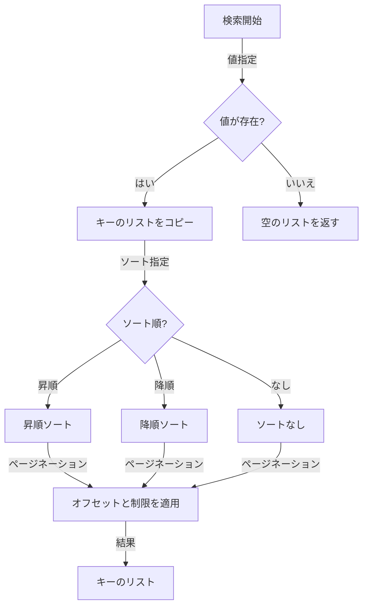

# 第7章: インデックス検索アルゴリズム

この章では、FuckBaseのインデックス検索アルゴリズムについて詳しく説明します。インデックスは、データベースのパフォーマンスを向上させるための重要な機能であり、FuckBaseでは効率的なインデックス検索を実現するためのアルゴリズムが実装されています。

## インデックスの基本概念

インデックスは、データの検索を高速化するためのデータ構造です。FuckBaseでは、特定のフィールドの値に基づいてデータを効率的に検索するための二次インデックスを提供しています。

```mermaid
graph TD
    A[データ] -->|インデックスなし| B[全件スキャン]
    B -->|O(n)| C[結果]
    
    A -->|インデックスあり| D[インデックス検索]
    D -->|O(1)| E[キーのリスト]
    E -->|データ取得| F[結果]
```

インデックスがない場合、データを検索するには全件スキャンが必要で、時間複雑度はO(n)です。一方、インデックスがある場合、検索対象のフィールド値からキーのリストを直接取得できるため、時間複雑度はO(1)になります。

## FuckBaseのインデックス構造

FuckBaseのインデックスは、フィールド値からキーのリストへのマッピングを保持する構造になっています。



`Values`マップは、フィールド値をキーとし、その値を持つすべてのデータのキーのリストを値として持ちます。例えば、`email`フィールドにインデックスを作成した場合、`Values`マップは以下のようになります：

```
Values = {
    "john@example.com": ["user1", "user5"],
    "alice@example.com": ["user2"],
    "bob@example.com": ["user3", "user7", "user9"]
}
```

この構造により、特定のメールアドレスを持つすべてのユーザーを効率的に検索することができます。

インデックスの実装の詳細は [../internal/database/index.go](../internal/database/index.go) で確認できます。

## インデックスの構築アルゴリズム

インデックスの構築は、Setのすべてのエントリをスキャンして行われます。以下は、インデックス構築のアルゴリズムです：



このアルゴリズムの実装は [../internal/database/index.go](../internal/database/index.go) の`Build`メソッドで確認できます。

### フィールド値の抽出

インデックス構築の重要な部分は、MessagePackエンコードされたデータからフィールド値を抽出することです。このプロセスは以下の手順で行われます：

1. MessagePackデータをデコードしてマップに変換
2. マップから指定されたフィールドの値を取得
3. 値を文字列に変換（数値、ブール値などの場合）



このアルゴリズムの実装は [../internal/database/index.go](../internal/database/index.go) の`extractFieldValue`メソッドで確認できます。

## インデックス検索アルゴリズム

インデックス検索は、指定されたフィールド値に一致するキーのリストを返します。以下は、インデックス検索のアルゴリズムです：



このアルゴリズムの実装は [../internal/database/index.go](../internal/database/index.go) の`Query`メソッドで確認できます。

### ソートとページネーション

FuckBaseのインデックス検索は、結果のソートとページネーションをサポートしています。

#### ソート

ソートは、以下の2つの方法で行うことができます：

- **昇順（asc）**: キーを辞書順で昇順にソート
- **降順（desc）**: キーを辞書順で降順にソート

ソートの実装は [../internal/database/index.go](../internal/database/index.go) の`Query`メソッドで確認できます。

#### ページネーション

ページネーションは、オフセットと制限を使用して実装されています：

- **オフセット**: スキップするアイテムの数
- **制限**: 返すアイテムの最大数

ページネーションの実装も [../internal/database/index.go](../internal/database/index.go) の`Query`メソッドで確認できます。

## インデックスの更新アルゴリズム

FuckBaseでは、データの変更（追加、更新、削除）に応じてインデックスを更新する必要があります。以下は、インデックス更新のアルゴリズムです：

### エントリの追加

```mermaid
graph TD
    A[エントリ追加] -->|フィールド値抽出| B{フィールドが存在?}
    B -->|はい| C[Values[fieldValue]にキーを追加]
    B -->|いいえ| D[何もしない]
```

### エントリの削除

```mermaid
graph TD
    A[エントリ削除] -->|フィールド値抽出| B{フィールドが存在?}
    B -->|はい| C[Values[fieldValue]からキーを削除]
    B -->|いいえ| D[何もしない]
    
    C -->|リストが空?| E{空?}
    E -->|はい| F[Values[fieldValue]を削除]
    E -->|いいえ| G[更新されたリストを保持]
```

### エントリの更新

```mermaid
graph TD
    A[エントリ更新] -->|古い値からフィールド値抽出| B[古いフィールド値]
    A -->|新しい値からフィールド値抽出| C[新しいフィールド値]
    
    B -->|削除処理| D[Values[oldFieldValue]からキーを削除]
    C -->|追加処理| E[Values[newFieldValue]にキーを追加]
```

これらのアルゴリズムの実装は [../internal/database/index.go](../internal/database/index.go) の`AddEntry`、`RemoveEntry`、`UpdateEntry`メソッドで確認できます。

## インデックスの性能特性

FuckBaseのインデックスは、以下の性能特性を持っています：

### 時間複雑度

- **構築**: O(n)（nはSetのエントリ数）
- **検索**: O(1)（ハッシュマップルックアップ）
- **ソート**: O(k log k)（kは検索結果のキー数）
- **追加**: O(1)
- **削除**: O(k)（kはフィールド値に対応するキーの数）
- **更新**: O(k)（kは古いフィールド値に対応するキーの数）

### 空間複雑度

インデックスの空間複雑度はO(n)です（nはSetのエントリ数）。各エントリのキーがインデックスに保存されるため、エントリ数に比例してメモリ使用量が増加します。

## インデックスの制限事項

FuckBaseのインデックスには、以下の制限事項があります：

1. **単一フィールドのみ**: 各インデックスは1つのフィールドにのみ対応しています。複合インデックスはサポートされていません。

2. **完全一致のみ**: インデックス検索は完全一致のみをサポートしています。部分一致や範囲検索はサポートされていません。

3. **文字列変換**: 数値やブール値などの非文字列フィールドは、検索のために文字列に変換されます。これにより、数値の範囲検索などの高度な検索機能が制限されます。

4. **インデックス更新のオーバーヘッド**: データの変更時にインデックスを更新する必要があるため、書き込み操作のパフォーマンスに影響を与える可能性があります。

## インデックス使用の最適化

FuckBaseでインデックスを効果的に使用するためのいくつかのベストプラクティスを紹介します：

1. **頻繁に検索されるフィールドにインデックスを作成**: 検索頻度の高いフィールドにインデックスを作成することで、検索パフォーマンスを向上させることができます。

2. **不要なインデックスを避ける**: 使用されないインデックスはメモリを消費し、書き込みパフォーマンスに影響を与えるため、必要なインデックスのみを作成することをお勧めします。

3. **カーディナリティの高いフィールドを選択**: ユニークな値が多いフィールド（例：ID、メールアドレス）にインデックスを作成すると、検索の効率が向上します。

4. **大きなデータセットの場合はページネーションを使用**: 大量の結果が予想される場合は、ページネーションを使用して結果を分割することをお勧めします。

## まとめ

FuckBaseのインデックス検索アルゴリズムは、シンプルながらも効率的に設計されています。フィールド値からキーのリストへのマッピングを使用することで、O(1)の時間複雑度で検索を行うことができます。また、ソートとページネーション機能により、検索結果を柔軟に処理することができます。

インデックスの構築、更新、検索のアルゴリズムを理解することで、FuckBaseを効果的に使用し、アプリケーションのパフォーマンスを最適化することができます。

インデックスの実装の詳細については、[../internal/database/index.go](../internal/database/index.go)、[../internal/database/index_test.go](../internal/database/index_test.go)、[../internal/database/index_integration_test.go](../internal/database/index_integration_test.go)、[../internal/database/index_missing_field_test.go](../internal/database/index_missing_field_test.go) を参照してください。